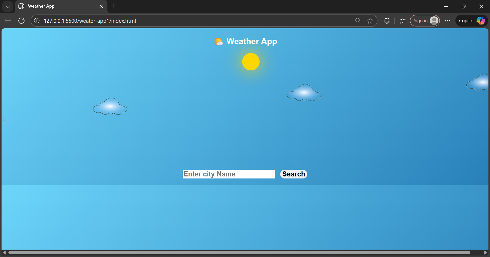

# 🌦️ Weather App

A simple and responsive weather application built using **HTML**, **CSS**, and **JavaScript** that displays real-time weather data for any city using the **OpenWeatherMap API**.

---


## 🚀 Features

* 🌍 Search weather by city name
* 🌡️ Displays temperature, humidity, and weather condition
* 🌈 Dynamic, animated background, or weather icons based on conditions
* ⚡ Fast, responsive UI

---

## 🧰 Tech Stack

* **HTML5** – Structure
* **CSS3** – Styling and layout
* **JavaScript (ES6)** – Logic and API integration
* **OpenWeatherMap API** – Weather data

---

## 🖼️ Screenshot

> *(Add your app screenshot here)*
> Example:
> 

---

## ⚙️ Installation & Setup

1. **Clone the repository**

   ```bash
   git clone https://github.com/Lalit-Tiwa/weather-app.git
   ```
1. **Docker Setup**
   > Sudo apt install docker.io -y 
   > sudo usermod -aG docker ubuntu
   > newgrp docker
    
2. **Navigate into the folder**

   ```bash
   cd weather-app
   ```
3. **Build docker image and container**
   > docker build -t weather.
   > docker run -d --name weather-app -p 8080:80 weather:latest 

4. Access weater-app using URL- http://<public-ip-address>:8080/

---

## 🔑 API Setup

1. Go to [OpenWeatherMap](https://openweathermap.org/api)
2. Create a free account and get your **API key**
3. In your JavaScript file (e.g., `script.js`), replace:

   ```js
   const apiKey = "YOUR_API_KEY_HERE";
   ```

   with your actual key.

---

## 🧪 Example Output

```
City: London
Temperature: 18°C
Humidity: 62%
Weather: Cloudy
```

---

## 🧑‍💻 Author

**Lalit Tiwari**
📧 [lalit.tiwarirkt@gmail.com]
🌐 [Your Portfolio or LinkedIn link]

---

## 📝 License

This project is licensed under the **MIT License** – feel free to use and modify it.

---

> ⭐ Don’t forget to give this repo a star if you found it helpful!


